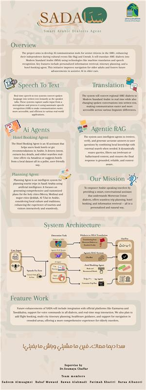

# Capstone-SADA 🎓

**Smart Arabic Dialects Agent (SADA)** — Capstone project that bridges the gap between **Arabic dialects** and **Modern Standard Arabic (MSA)**.  
SADA integrates **machine translation**, **speech recognition**, and **intelligent agents** to support users in real-world scenarios such as **trip planning** and **hotel booking**.  

---

## 📖 Project Overview

One of the major challenges during Hajj and Umrah seasons is the difficulty of understanding the **Maghrebi Arabic dialect** in Saudi Arabia, which can create communication barriers between visitors from Morocco and local service providers.  

**SADA** is an intelligent system designed to solve this issue by:  
- 🏨 Helping visitors search for and book hotels based on their preferred prices and features.  
- 🧳 Generating personalized travel plans according to the city, type of trip, and number of days.  
- ❓ Answering general questions related to their journey.  
- 🌐 Automatically translating from Maghrebi Arabic dialect into Modern Standard Arabic (MSA) to ensure smooth communication.  

This way, SADA enhances the overall experience of pilgrims and visitors from Morocco by making services more accessible and seamless.  

---

## ✨ Features

- 🌐 Dialect to MSA Translation (focus on Maghrebi dialects).  
- 🗣️ Speech-to-Text Integration.  
- 🧠 NER (Named Entity Recognition) for extracting booking details (dates, budget, location, preferences).  
- 🔎 RAG (Retrieval-Augmented Generation) for enhanced responses.  
- 🏨 Hotel Booking Agent integrated with Amadeus API and NER model.  
- 🧳 Trip Planning Agent generating personalized travel plans.  

---

## 🏗️ Project Architecture

  

---

## 🎥 Demo

Here is a short demonstration of **SADA** in action:  

- 🏨 **Hotel Booking**: The system extracts details such as check-in/check-out dates, budget, and preferences from Maghrebi Arabic input, then recommends suitable hotels.  
- 🧳 **Trip Planning**: Generates a customized travel plan based on the city, trip type, and number of days.  
- 🌐 **Dialect Translation**: Converts Maghrebi Arabic into Modern Standard Arabic (MSA) for smooth communication.  
- ❓ **Q&A Assistant**: Answers visitor questions related to their journey.  

### ▶️ Watch the Demo  
- [Demo Video](sada_demo.mp4) 
---

## 👥 Authors

- **Sadeem Almugamsi**  
- **Rahaf Muwaed**  
- **Rawan Alahmadi**  
- **Baraa Alhanoti**  
- **Fatimah Khatiri**  

*Project supervised by **Dr. Soumaya Chaffar***  

---

## 📄 License

This project is licensed under **All Rights Reserved** — see the [LICENSE](LICENSE) file for details.  
